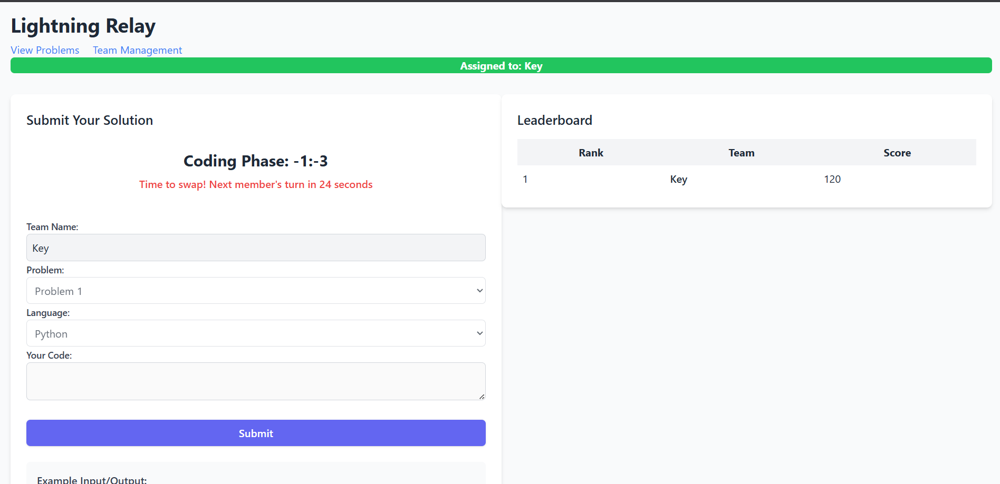

# 🏆 Code Relay Judge System

A competitive programming judge system for exciting code relay competitions! 🚀

## ✨ Features

- **🌐 Multi-language Support**: Run code in Python, Java, C++, C, and JavaScript
- **🔒 Secure Execution**: All code runs in isolated Docker containers for safety
- **⚡ Real-time Updates**: Track submission status and leaderboard changes instantly
- **🧩 Multiple Problems**: Support for various coding challenges with detailed descriptions
- **🔄 Team Rotation System**: Automatic timer for team member rotation during relay
- **✅ Automatic Testing**: Solutions are tested against multiple test cases
- **📊 Live Leaderboard**: Real-time scoring and team rankings

## 🧠 What is Code Relay?

Code Relay is a team-based competitive programming format where:

1. Teams of programmers solve algorithmic problems together
2. Each team member gets a fixed time window to code
3. When the timer runs out, the next team member continues where the previous left off
4. The goal is to solve as many problems as possible with the highest score

It's a fun way to practice coding and teamwork under pressure! 💪

## 🏗️ Architecture

### Server (`server.js`)

Express.js server handling HTTP requests for submissions, status checks, and leaderboard data.

### Submission Queue (`queue.js`)

Manages code submissions with:
- In-memory queue for pending submissions
- Sequential processing to prevent resource contention
- Result storage and leaderboard updates

### Code Runner (`run_code.js`)

Executes submitted code by:
- Creating isolated Docker containers
- Mounting code files and test inputs
- Running against test cases
- Comparing outputs with expected results
- Calculating scores based on passed tests

### Database (`database.js`)

Simple file-based storage for:
- Submission results
- Leaderboard data
- Competition state

## 🖥️ User Interface

The web interface provides:
- Code submission form with language selection
- Problem descriptions with examples
- Real-time timer for team member rotation
- Test results showing passed/failed cases
- Live updating leaderboard

## 🚀 Setup Guide

### Prerequisites

- 📦 Node.js (v14 or higher)
- 🐳 Docker
- 📋 npm or yarn

### Installation

1. **Clone the repository**
   ```bash
   git clone https://github.com/yourname/code-relay-judge.git
   cd code-relay-judge
   ```

2. **Install dependencies**
   ```bash
   npm install
   ```

3. **Build CSS (optional)**
   ```bash
   npm run build:css
   ```

4. **Setup problems**
   ```bash
   node setup_all_problems.js
   ```

5. **Configure teams (optional)**
   Edit `team_config.js` to set up teams and members

### Starting the Competition

1. **Reset the competition state (if needed)**
   ```bash
   node reset.js
   ```

2. **Start the server**
   ```bash
   node server.js
   ```

3. **Access the web interface** at `http://localhost:6969`

## 💡 Adding Custom Problems

To add your own problems:

1. Create a new directory in `/problems/` (e.g., `problems/problem4/`)
2. Add test cases in `/problems/problem4/testcases/`
3. Create input files (`input1.in`, `input2.in`, etc.) and their corresponding output files (`input1.out`, `input2.out`, etc.)
4. Update `problems.html` to include your problem description

## 📁 File Structure

- `/submissions/`: Submitted code files
- `/problems/`: Problem descriptions and test cases
- `/db/`: Leaderboard and results data
- `/public/`: Frontend files
- `/config/`: Configuration files

## 🧪 Testing

You can test code submissions without affecting the leaderboard using the test endpoint:

```bash
curl -X POST http://localhost:6969/test \
  -F "team=testteam" \
  -F "problem=problem1" \
  -F "language=py" \
  -F "code=@solution.py"
```

## 📋 API Endpoints

- **POST /submit/text**: Submit code as text
- **POST /submit/file**: Submit code as a file
- **GET /status/:jobId**: Get submission status
- **GET /leaderboard**: Get current leaderboard
- **GET /queue/status**: Get queue status

## 🔄 Resetting the Competition

To reset all scores and start fresh:
```bash
node reset.js
```

## 🖼️ Interface Preview

### Main Interface
The main interface shows the code editor, problem selector, and leaderboard in a clean layout.


### Problem Descriptions 
Problems are displayed with clear descriptions, input/output formats, and examples.


### Team Management
Teams can be configured with multiple members for rotation during relay phases.


### Submission Results
Results show detailed feedback on test cases passed and any errors encountered.


## 🛠️ Requirements

- Node.js
- Docker
- npm packages: express, fs-extra, multer
- Tailwind CSS (for styling)

## 🤝 Contributing

Contributions are welcome! Please feel free to submit a Pull Request.

## 📝 License

This project is open source and available under the [MIT License](LICENSE).

---

Happy coding! 🎉